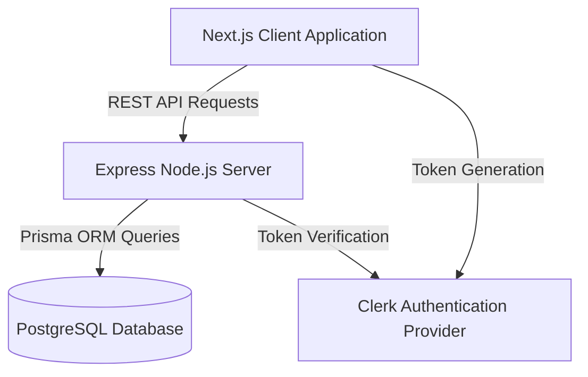

# CompileHire

CompileHire is a next-generation AI-powered platform designed to prepare candidates for technical interviews. It provides real-time conversational simulations, an advanced code execution environment, and an automated resume analyzer, all housed within a professional, dark-mode workspace.

## System Architecture

The platform utilizes a decoupled client-server architecture. The frontend is built with Next.js and handles all user interactions, Monaco-based code editing, and complex 3D rendering. The backend is an Express server responsible for secure API routing, database transactions, and authentication validation.



## Technology Stack

### Frontend (Client)
*   **Framework:** Next.js (App Router)
*   **Language:** TypeScript
*   **Styling:** Tailwind CSS
*   **Animations:** Framer Motion, Three.js (React Three Fiber)
*   **Core Components:** Monaco Editor (Code editing), React-Resizable-Panels (Workspace layout)
*   **Authentication:** Clerk React SDK

### Backend (Server)
*   **Runtime:** Node.js
*   **Framework:** Express.js
*   **Database:** PostgreSQL (Hosted on Neon Tech)
*   **ORM:** Prisma
*   **Authentication:** Clerk Backend SDK

## Repository Structure

```text
Compile-Hire/
├── client/                 # Next.js frontend application
│   ├── public/             # Static assets
│   ├── src/
│   │   ├── app/            # Next.js App Router pages
│   │   ├── components/     # Reusable React components
│   │   └── lib/            # Utility functions
│   ├── package.json
│   └── tailwind.config.ts
├── server/                 # Express backend application
│   ├── prisma/             # Database schema and migrations
│   ├── src/
│   │   ├── index.js        # Main server entry point
│   │   └── ...
│   └── package.json
└── README.md               # Root documentation
```

## Getting Started

### Prerequisites
*   Node.js (v18 or higher recommended)
*   npm or yarn

### Installation

1.  **Clone the repository:**
    ```bash
    git clone https://github.com/Abhijeet-kumar-04/Compile-Hire.git
    cd Compile-Hire
    ```

2.  **Install Client Dependencies:**
    ```bash
    cd client
    npm install
    cd ..
    ```

3.  **Install Server Dependencies:**
    ```bash
    cd server
    npm install
    cd ..
    ```

### Running the Application Locally

You will need two separate terminal windows to run both the client and the server simultaneously.

**Terminal 1 (Server):**
```bash
cd server
npm run dev
```
*The server will start on port 5000.*

**Terminal 2 (Client):**
```bash
cd client
npm run dev
```
*The client will start on port 3000. Navigate to `http://localhost:3000` in your browser.*

---
*For detailed information regarding environment variables and specific configurations, please refer to the `README.md` files located in the `client` and `server` directories respectively.*
