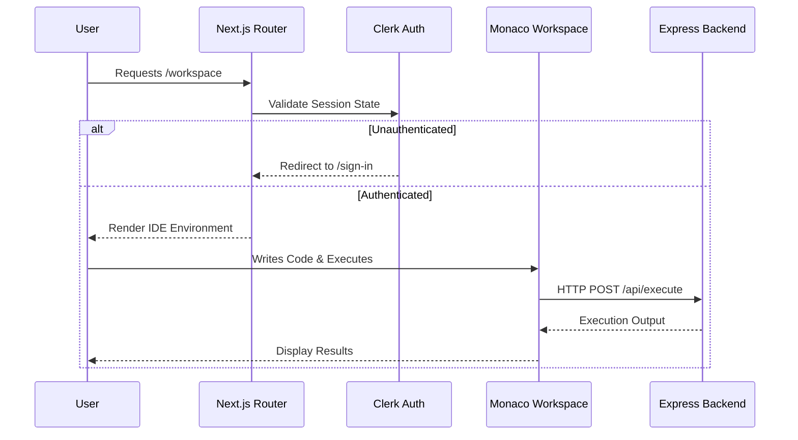

# CompileHire Client Application

This directory contains the frontend Next.js application for CompileHire. It is responsible for delivering a high-performance, dark-themed user interface, managing the interactive coding environment, and communicating securely with the backend API.

## Core Technologies

*   **Next.js 14 (App Router):** Utilized for server-side rendering, routing, and optimizing static assets.
*   **React 19:** The core library for building the user interface components.
*   **Monaco Editor:** Provides the professional, VS Code-like code editing experience within the browser.
*   **Tailwind CSS:** A utility-first CSS framework used for all styling and responsive design.
*   **Framer Motion:** Handles all complex UI animations and layout transitions.
*   **React Three Fiber / Three.js:** Powers the 3D 'Tesseract' interactive animation on the landing page.
*   **Clerk React SDK:** Manages user authentication, session state, and secure route protection.

## Client Architecture Flow



## Directory Structure

```text
client/
├── public/                 # Public assets (images, icons)
├── src/
│   ├── app/                # Next.js file-system routing
│   │   ├── dashboard/      # User portal and statistics
│   │   ├── history/        # Past interview records
│   │   ├── workspace/      # Core IDE environment
│   │   ├── layout.tsx      # Root application layout
│   │   └── page.tsx        # Public landing page
│   ├── components/         # Modular React components
│   │   ├── workspace/      # IDE specific components (Panels, Editor)
│   │   ├── TesseractCore.tsx # 3D Landing page animation
│   │   └── GlitchLink.tsx  # Custom animated link component
│   └── lib/                # Utility functions and shared logic
├── .env.local              # Local environment variables
├── next.config.mjs         # Next.js configuration
├── tailwind.config.ts      # Tailwind styling rules
└── tsconfig.json           # TypeScript configuration
```

## Environment Configuration

To run the client application, you must create a `.env.local` file in the root of the `client` directory with the following variables:

```env
NEXT_PUBLIC_CLERK_PUBLISHABLE_KEY=your_clerk_publishable_key
CLERK_SECRET_KEY=your_clerk_secret_key
NEXT_PUBLIC_CLERK_SIGN_IN_URL=/sign-in
NEXT_PUBLIC_CLERK_SIGN_UP_URL=/sign-up
NEXT_PUBLIC_CLERK_AFTER_SIGN_IN_URL=/dashboard
NEXT_PUBLIC_CLERK_AFTER_SIGN_UP_URL=/dashboard
```

## Scripts

*   `npm run dev`: Starts the Next.js development server on `localhost:3000`.
*   `npm run build`: Creates an optimized production build.
*   `npm run start`: Starts the application in production mode.
*   `npm run lint`: Runs ESLint to verify code quality.
